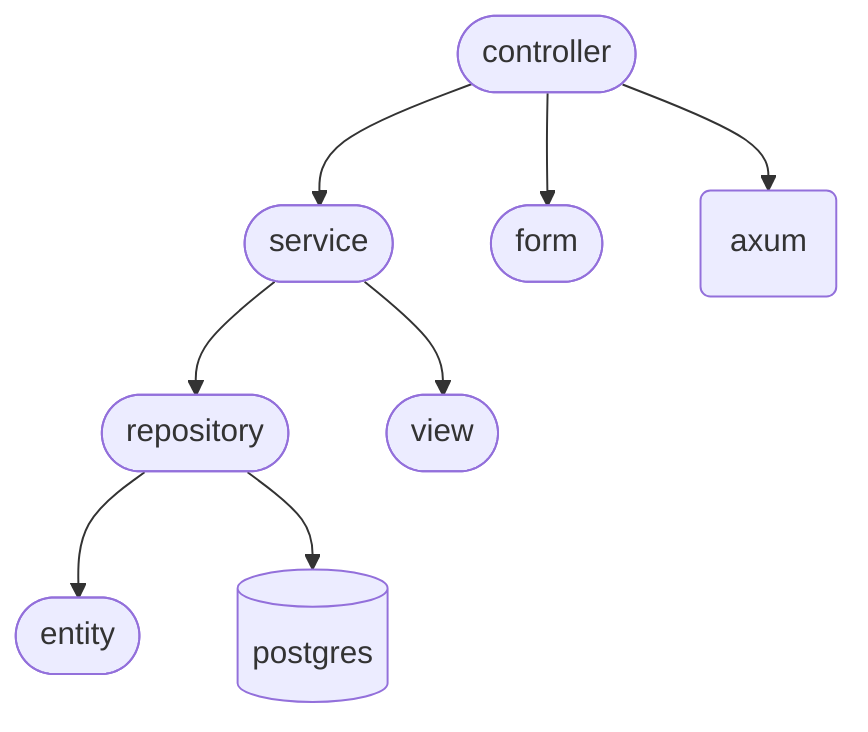

# Architectural Decisions

## Layers

|モジュール|役割|技術的関心事|
|-|-|-|
|コントローラー|Webフレームワークを取り扱う|axum|
|サービス|ユースケースを実装する|-|
|エンティティ|ビジネスモデルを実装する|-|
|リポジトリ（定義）|エンティティの取得・保存の仕様を定義する|-|
|リポジトリ（実装）|リポジトリ（定義）に沿って具体的な処理を実装したもの|PostgreSQL|
|フォーム|フォームデータのデータ構造を定義する|-|
|ビュー|レスポンスのデータ構造を定義する|-|

## Dependency Graph

